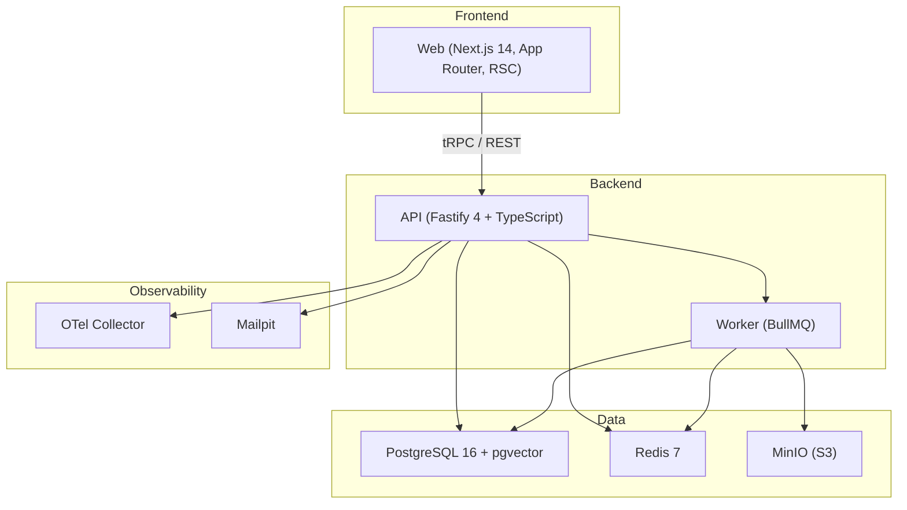

# OpsCore — Enterprise Operations Intelligence Platform

**OpsCore** unifies operational data ingestion, real-time KPI monitoring, AI-assisted root-cause analysis, and incident resolution workflows into a single, production-grade SaaS platform for mid-to-large organizations.

## Architecture



### Modules

| Module | Bounded Context | Key Entities |
|--------|----------------|--------------|
| **Identity** | Users, Orgs, RBAC | User, Organization, Membership, Invitation |
| **Observability** | Signals, KPIs | Signal, KPI, KPISnapshot, Anomaly |
| **Incidents** | Workflow | Incident, IncidentEvent, Comment, SLA |
| **Copilot** | AI Agent | Conversation, Message, Citation |
| **Reports** | Exports | Report, ReportRun, Export |
| **Audit** | Immutable Log | AuditEntry |

## Quick Start

```bash
# Prerequisites: Node.js 20+, pnpm 9+, Docker

# 1. Clone and install
git clone <repo-url>
cd opscore
pnpm install

# 2. Start infrastructure
docker compose up -d

# 3. Run migrations and seed
pnpm db:migrate
pnpm db:seed

# 4. Start development
pnpm dev
```

The web app runs at `http://localhost:3000`, API at `http://localhost:3001`.

### Demo credentials
- **Owner:** owner@acme.test / Password1!
- **Manager:** manager@acme.test / Password1!
- **Engineer:** engineer@acme.test / Password1!

## Where Do I Find…

| Topic | Location |
|-------|----------|
| Architecture Decision Records | [`docs/adr/`](docs/adr/) |
| API documentation (OpenAPI) | [`docs/api/`](docs/api/) |
| Database schema & query budgets | [`docs/db/`](docs/db/) |
| SRE: SLOs & runbooks | [`docs/sre/`](docs/sre/) |
| Security: ASVS mapping | [`docs/security/`](docs/security/) |
| Onboarding guide | [`docs/onboarding/`](docs/onboarding/) |
| Helm chart | [`deploy/helm/opscore/`](deploy/helm/opscore/) |
| Docker configs | [`deploy/docker/`](deploy/docker/) |
| E2E tests | [`e2e/`](e2e/) |
| AI eval harness | [`eval/`](eval/) |

## ADRs

- [ADR-0001: Modular Monolith Over Microservices](docs/adr/ADR-0001-modular-monolith.md)
- [ADR-0002: Drizzle ORM Over Prisma](docs/adr/ADR-0002-drizzle-orm.md)
- [ADR-0003: Recharts for Data Visualization](docs/adr/ADR-0003-recharts.md)
- [ADR-0004: next-intl for Internationalization](docs/adr/ADR-0004-next-intl.md)

## Tech Stack

| Layer | Technology |
|-------|-----------|
| Frontend | Next.js 14 (App Router), React 18, TypeScript 5, Tailwind CSS, Radix UI |
| Backend | Fastify 4, Node.js 20, TypeScript 5 (strict) |
| Database | PostgreSQL 16 + pgvector, Drizzle ORM, RLS multi-tenancy |
| Cache/Queue | Redis 7, BullMQ |
| AI | Anthropic Claude (default), OpenAI fallback |
| Auth | argon2id, JWT (access + refresh), RBAC, optional TOTP 2FA |
| Observability | OpenTelemetry, Pino (structured JSON), Prometheus metrics |
| Testing | Vitest (unit/integration), Playwright (E2E) |
| Deployment | Docker Compose, Helm/Kubernetes, Caddy |

## Multi-Tenancy

OpsCore uses logical multi-tenancy with `tenant_id` on every row and PostgreSQL Row-Level Security (RLS). The application sets `app.current_tenant` per request, and RLS policies ensure complete data isolation at the database level.

## License

Proprietary. All rights reserved.
